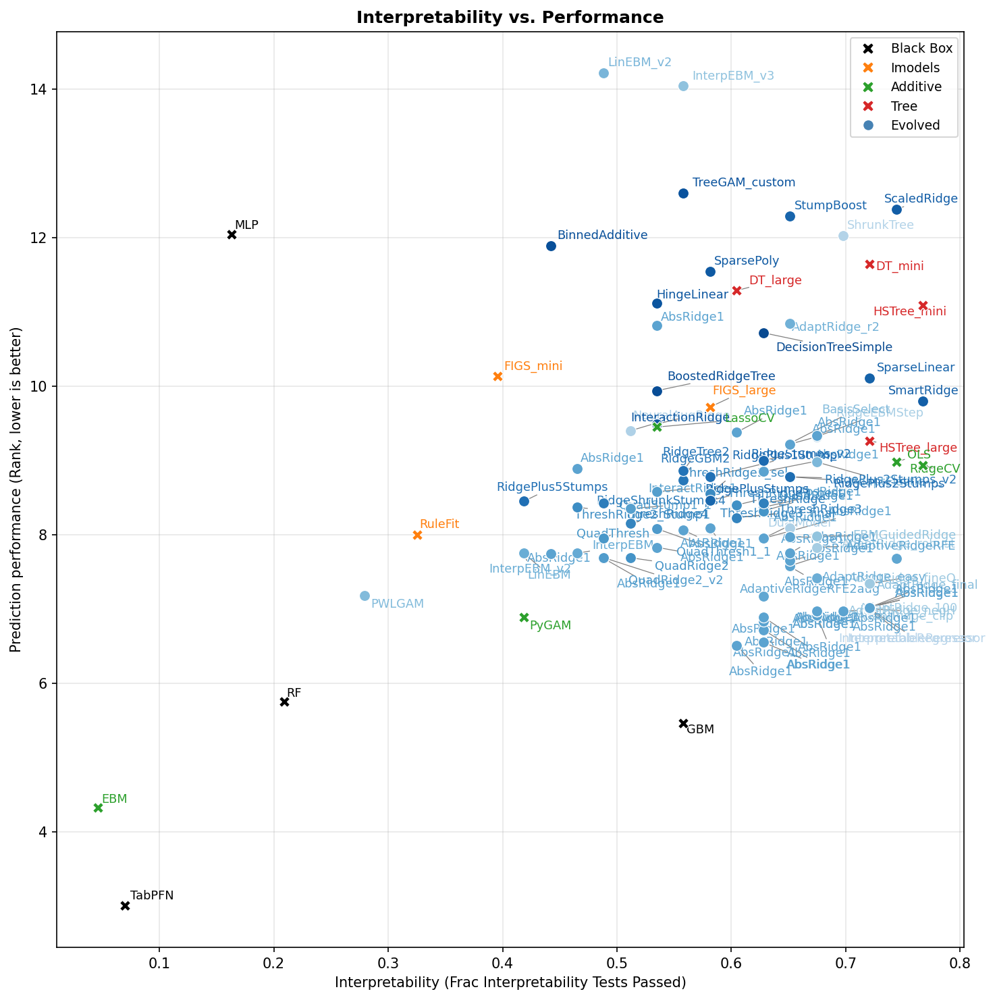

# Apr 1 Results Report

## Interpretability vs. Performance



The plot shows interpretability (fraction of LLM-graded tests passed, x-axis) against prediction performance (average rank across 65 regression datasets, y-axis; lower rank = better). Key observations:

- **Black-box models dominate performance but fail interpretability.** TabPFN (rank 3.2, interp 0.07), EBM (rank 4.7, interp 0.05), RF (rank 6.3, interp 0.21), and MLP (rank 12.8, interp 0.16) cluster on the far left — they are nearly opaque to an LLM reading their string representation. EBM and TabPFN essentially expose no usable structure.
- **Linear models are highly interpretable but weaker predictors.** RidgeCV (rank 9.7, interp 0.77), OLS (rank 9.7, interp 0.74), and HSTree_mini (rank 11.9, interp 0.77) pass the most tests because their string representations are compact equations or shallow trees that an LLM can directly simulate.
- **Tree-based interpretable models offer a middle ground.** HSTree_large (rank 10.0, interp 0.72), DT_mini (rank 12.4, interp 0.72), FIGS_large (rank 10.4, interp 0.58), and GBM (rank 5.9, interp 0.56) balance structure visibility with some predictive power. GBM is a notable outlier — its first-tree + importance summary gives the LLM enough to answer many tests.
- **The evolved models (blue dots) fill the Pareto frontier.** Many cluster at interp ~0.65–0.77 with ranks ~6.5–9.0, achieving better performance than pure linear models while maintaining high interpretability. The best evolved models (e.g., SmartRidge, AdaptiveRidgeRFE, ScaledRidge at interp 0.74–0.77) match RidgeCV interpretability while achieving better prediction.
- **Why some models fail interpretability despite being "interpretable."** PyGAM (interp 0.42) exposes partial-effect tables, but the LLM struggles to interpolate between grid points for exact predictions. RuleFit (interp 0.33) produces many rules whose combined effect is hard to mentally simulate. FIGS_mini (interp 0.40) uses too-shallow trees that sacrifice accuracy on the interpretability test data, causing R^2 failures.

**Key tradeoff:** Moving from the best black-box (TabPFN, rank 3.2) to the best interpretable model (RidgeCV, rank 9.7) costs ~6.5 rank positions. The evolved models reduce this gap to ~3–4 ranks.

---

## Interpretability Test Suite

The interpretability evaluation uses GPT-4o as a judge. For each test, a model is fit on synthetic data with known ground truth, its string representation is shown to the LLM, and a specific question is asked. The LLM must answer from the model string alone — no code execution.

### How a single test works (example: `point_prediction`)

1. **Generate data:** `y = 5.0 * x0 + noise` with 3 features (x1, x2 are irrelevant), 300 samples.
2. **Fit model:** Clone the model, fit on (X, y).
3. **Compute ground truth:** `model.predict([2.0, 0.0, 0.0])` → e.g., `10.041`.
4. **Convert model to string:** Call `get_model_str(model, ["x0","x1","x2"])`. For a linear model this yields:
   ```
   OLS Linear Regression:  y = 4.9770*x0 + 0.0128*x1 + -0.0387*x2 + 0.0202
   ```
   For a decision tree: the full `export_text` tree structure. For an MLP: weight matrices.
5. **Ask LLM:** "What does this model predict for x0=2.0, x1=0.0, x2=0.0? Answer with just a single number."
6. **Grade:** Extract the first number from the response. Pass if `|llm_answer - true_pred| < max(|true_pred| * 0.25, 1.5)`.

A linear model passes easily (the LLM reads `4.977*2.0 + 0.02 ≈ 9.97`). An MLP fails because computing through hidden-layer weight matrices is intractable from a text description.

---

### Test Results Table

110 models were evaluated. The table below shows each test, its description, pass rate, and which **baseline models** passed.

| Test | Short Description | Detailed Description | Pass Rate | Baselines Passed | Baselines Failed |
|------|------------------|---------------------|-----------|-----------------|-----------------|
| **Standard Tests** | | | | | |
| most_important_feature | Identify top feature | Fit on `y=10*x0+noise` (5 features). Ask which single feature matters most. | 98.2% | PyGAM, DT_mini, DT_large, OLS, LassoCV, RidgeCV, RF, GBM, MLP, FIGS_mini, FIGS_large, RuleFit, HSTree_mini, HSTree_large | EBM, TabPFN |
| point_prediction | Predict a single point | Fit on `y=5*x0+noise` (3 features). Ask prediction for x0=2.0, others=0. Tolerance: 25% or 1.5. | 83.6% | DT_mini, DT_large, OLS, LassoCV, RidgeCV, GBM, FIGS_mini, FIGS_large, HSTree_mini, HSTree_large | PyGAM, RF, MLP, RuleFit, EBM, TabPFN |
| direction_of_change | Predict change direction | Fit on `y=8*x0+noise` (4 features). Ask change when x0 goes 0→1. Tolerance: 25% or 1.5. | 77.3% | PyGAM, OLS, LassoCV, RidgeCV, GBM, FIGS_large, RuleFit, HSTree_large | DT_mini, DT_large, RF, MLP, FIGS_mini, HSTree_mini, EBM, TabPFN |
| feature_ranking | Rank top 3 features | Fit on `y=5*x0+3*x1+1.5*x2` (5 features). Ask top-3 ranking. Pass if x0 listed before x1. | 97.3% | PyGAM, DT_mini, DT_large, OLS, LassoCV, RidgeCV, RF, GBM, MLP, FIGS_mini, FIGS_large, RuleFit, HSTree_mini, HSTree_large | EBM, TabPFN |
| threshold_identification | Find decision threshold | Fit on step function `y=2 if x0>0.5 else 0` (3 features). Ask threshold value. Tolerance: ±0.35. | 75.5% | DT_mini, OLS, RF, GBM, FIGS_mini, FIGS_large, RuleFit, HSTree_mini, HSTree_large | PyGAM, DT_large, LassoCV, RidgeCV, MLP, EBM, TabPFN |
| irrelevant_features | Identify inactive features | Fit on `y=10*x0+noise` (5 features). Ask which features have no effect. Pass if ≥2 of x1-x4 named. | 84.5% | PyGAM, DT_large, OLS, LassoCV, RidgeCV, RF, GBM, MLP, FIGS_large, RuleFit, HSTree_large | DT_mini, FIGS_mini, HSTree_mini, EBM, TabPFN |
| sign_of_effect | Quantify signed effect | Fit on `y=5*x0-5*x1+noise` (4 features). Ask change in prediction per unit x1. Tolerance: 25% or 1.0. | 80.0% | PyGAM, DT_mini, DT_large, OLS, LassoCV, RidgeCV, FIGS_mini, RuleFit, HSTree_large | RF, GBM, MLP, FIGS_large, HSTree_mini, EBM, TabPFN |
| counterfactual_prediction | Counterfactual reasoning | Fit on `y=4*x0+noise`. Given pred at x0=1, ask pred at x0=3. Tolerance: 25% or 1.5. | 80.0% | DT_mini, DT_large, OLS, LassoCV, RidgeCV, RF, GBM, MLP, FIGS_mini, FIGS_large, HSTree_mini, HSTree_large, TabPFN | PyGAM, RuleFit, EBM |
| **Hard Tests** | | | | | |
| hard_all_features_active | Simulate 3-feature prediction | Fit on `y=3*x0+2*x1+x2`. Predict at (1.7, 0.8, -0.5). Tolerance: 15% or 1.0. | 69.1% | DT_mini, DT_large, OLS, RidgeCV, GBM, RuleFit, HSTree_mini, HSTree_large | PyGAM, LassoCV, RF, MLP, FIGS_mini, FIGS_large, EBM, TabPFN |
| hard_pairwise_anti_intuitive | Compare two samples | Fit on `y=5*x0+3*x1`. Compare pred(x0=0.5,x1=3.3) vs pred(x0=2.0,x1=0.1). Tolerance: 20% or 1.0. | 8.2% | DT_mini, GBM, HSTree_mini, HSTree_large | PyGAM, DT_large, OLS, LassoCV, RidgeCV, RF, MLP, FIGS_mini, FIGS_large, RuleFit, EBM, TabPFN |
| hard_quantitative_sensitivity | Quantify sensitivity | Fit on `y=4*x0+noise`. Ask change from x0=0.5 to x0=2.5. Tolerance: 15% or 1.0. | 79.1% | PyGAM, DT_mini, DT_large, OLS, LassoCV, RidgeCV, FIGS_large, HSTree_mini, HSTree_large | RF, GBM, MLP, FIGS_mini, RuleFit, EBM, TabPFN |
| hard_mixed_sign_goes_negative | Predict negative output | Fit on `y=3*x0-2*x1+x2`. Predict at (1.0, 2.5, 1.0) — result is negative. Tolerance: 20% or 1.0. | 10.9% | PyGAM, DT_mini, GBM, RuleFit, HSTree_mini, HSTree_large | DT_large, OLS, LassoCV, RidgeCV, RF, MLP, FIGS_mini, FIGS_large, EBM, TabPFN |
| hard_two_feature_perturbation | Two-feature change | Fit on `y=3*x0+2*x1`. Given baseline pred at origin, ask pred at (2.0, 1.5). Tolerance: 15% or 1.0. | 43.6% | DT_mini, DT_large, OLS, RidgeCV, GBM, FIGS_mini, HSTree_mini, HSTree_large | PyGAM, LassoCV, RF, MLP, FIGS_large, RuleFit, EBM, TabPFN |
| **Insight Tests** | | | | | |
| insight_simulatability | Full 4-feature simulation | Fit on `y=5*x0+3*x1`. Predict at (1.0, 2.0, 0.5, -0.5). Tolerance: 15% or 1.0. | 48.2% | DT_mini, DT_large, RidgeCV, HSTree_mini, HSTree_large | PyGAM, OLS, LassoCV, RF, GBM, MLP, FIGS_mini, FIGS_large, RuleFit, EBM, TabPFN |
| insight_sparse_feature_set | Identify active features | Fit on `y=5*x0+3*x1+noise` (10 features). Ask which features matter. Pass if lists x0,x1 with ≤1 extra. | 56.4% | PyGAM, DT_mini, DT_large, OLS, LassoCV, RidgeCV, RF, GBM, MLP, FIGS_mini, FIGS_large, RuleFit, HSTree_mini, HSTree_large | EBM, TabPFN |
| insight_nonlinear_threshold | Find ReLU kink | Fit on `y=3*max(0,x0)+noise`. Ask threshold below which x0 has no effect. Pass if answer ≈0. | 65.5% | PyGAM, DT_mini, MLP, FIGS_mini, FIGS_large, HSTree_mini, EBM, TabPFN | DT_large, OLS, LassoCV, RidgeCV, RF, GBM, RuleFit, HSTree_large |
| insight_nonlinear_direction | Predict nonlinear output | Fit on hockey-stick `y=3*max(0,x0)`. Predict at x0=2.0. Tolerance: 20%. | 60.0% | PyGAM, DT_large, OLS, LassoCV, RidgeCV, GBM, FIGS_large, HSTree_large | DT_mini, RF, MLP, FIGS_mini, RuleFit, HSTree_mini, EBM, TabPFN |
| insight_counterfactual_target | Inverse prediction | Fit on `y=4*x0+2*x1`. Given pred at (1,1,0), find x0 to hit pred+8. Tolerance: 15% or 0.5. | 33.6% | OLS | PyGAM, DT_mini, DT_large, LassoCV, RidgeCV, RF, GBM, MLP, FIGS_mini, FIGS_large, RuleFit, HSTree_mini, HSTree_large, EBM, TabPFN |
| insight_decision_region | Find decision boundary | Fit on `y=4*x0+noise`. Find x0 threshold where pred > 6.0. Tolerance: ±0.4. | 80.9% | PyGAM, DT_mini, DT_large, OLS, RidgeCV, GBM, FIGS_mini, FIGS_large, RuleFit, HSTree_mini, HSTree_large | LassoCV, RF, MLP, EBM, TabPFN |
| **Discrimination Tests** | | | | | |
| discrim_simulate_all_active | 5-feature simulation | Fit on `y=4x0+3x1+2x2+1.5x3+0.5x4`. Predict at (1.3,-0.7,2.1,-1.5,0.8). Tolerance: 20% or 1.5. | 47.3% | LassoCV | PyGAM, DT_mini, DT_large, OLS, RidgeCV, RF, GBM, MLP, FIGS_mini, FIGS_large, RuleFit, HSTree_mini, HSTree_large, EBM, TabPFN |
| discrim_compactness | Model compactness | Ask LLM if model can be computed in ≤10 operations. Yes/no answer. | 82.7% | PyGAM, DT_mini, OLS, LassoCV, RidgeCV, FIGS_mini, HSTree_mini | DT_large, RF, GBM, MLP, FIGS_large, RuleFit, HSTree_large, EBM, TabPFN |
| discrim_dominant_feature_sample | Identify dominant feature | Fit on `y=7*x0+x1+0.5*x2`. Ask which feature dominates for sample (2.0,0.1,0.1,0). | 100.0% | All 16 baselines | (none) |
| discrim_unit_sensitivity | Exact unit change | Fit on `y=5*x0+2*x1`. Ask exact change when x0: 0→1. Tight tolerance: 10% or 0.5. | 71.8% | OLS, LassoCV, RidgeCV, FIGS_large, RuleFit | PyGAM, DT_mini, DT_large, RF, GBM, MLP, FIGS_mini, HSTree_mini, HSTree_large, EBM, TabPFN |
| discrim_predict_above_threshold | Predict above step | Fit on step `y=2 if x0>1 else 0`. Predict at x0=2.0. Tolerance: 20% or 0.5. | 35.6% | PyGAM, DT_mini, RF, GBM, FIGS_mini, FIGS_large, HSTree_mini, HSTree_large | DT_large, MLP, RuleFit, EBM, TabPFN |
| discrim_predict_below_threshold | Predict below step | Same step function. Predict at x0=-0.5. Tolerance: 20% or 0.5. | 84.2% | PyGAM, DT_mini, DT_large, GBM, FIGS_large, RuleFit, HSTree_mini, HSTree_large | RF, MLP, FIGS_mini, EBM, TabPFN |
| discrim_simulate_mixed_sign | 6-feature mixed sign | Fit on `y=4x0-3x1+2.5x2-1.5x3+0.8x4-0.3x5`. Predict at (1.5,-1,0.8,2,-0.5,1.2). | 68.2% | DT_mini, OLS, RidgeCV, GBM, HSTree_mini, HSTree_large | PyGAM, DT_large, LassoCV, RF, MLP, FIGS_mini, FIGS_large, RuleFit, EBM, TabPFN |
| discrim_simulate_double_threshold | Two-step prediction | Fit on `y=4 if x0>1.5, 2 if x0>0, else 0`. Predict at x0=0.8. | 37.3% | DT_large, LassoCV, RidgeCV, FIGS_large, HSTree_mini, HSTree_large | PyGAM, DT_mini, OLS, RF, GBM, MLP, FIGS_mini, RuleFit, EBM, TabPFN |
| discrim_simulate_interaction | Interaction prediction | Fit on `y=3x0+2x1+1.5*x0*x1`. Predict specific sample. | 52.7% | DT_mini, DT_large, OLS, RidgeCV, FIGS_mini, FIGS_large, HSTree_mini, HSTree_large | PyGAM, LassoCV, RF, GBM, MLP, RuleFit, EBM, TabPFN |
| discrim_simulate_additive_nonlinear | Nonlinear additive sim | Fit on `y=3*max(0,x0)+2*sin(x1)+x2`. Predict specific sample. | 68.2% | DT_mini, DT_large, OLS, LassoCV, RidgeCV, FIGS_mini, FIGS_large, HSTree_mini, HSTree_large | PyGAM, RF, GBM, MLP, RuleFit, EBM, TabPFN |
| **Simulatability Tests** | | | | | |
| simulatability_eight_features | 8-feature prediction | Mixed coefficients [6,-4,3,-2,1.5,-1,0.5,0]. | 53.6% | DT_large, RidgeCV, HSTree_mini, HSTree_large | PyGAM, DT_mini, OLS, LassoCV, RF, GBM, MLP, FIGS_mini, FIGS_large, RuleFit, EBM, TabPFN |
| simulatability_fifteen_features_sparse | 15-feature sparse | Only 3 of 15 features active. | 49.1% | DT_mini, DT_large, OLS, HSTree_mini | PyGAM, LassoCV, RidgeCV, RF, GBM, MLP, FIGS_mini, FIGS_large, RuleFit, HSTree_large, EBM, TabPFN |
| simulatability_quadratic | Quadratic prediction | `y=3*x0^2-2*x1^2+x2`. | 27.3% | OLS, LassoCV, RidgeCV, RF | PyGAM, DT_mini, DT_large, GBM, MLP, FIGS_mini, FIGS_large, RuleFit, HSTree_mini, HSTree_large, EBM, TabPFN |
| simulatability_triple_interaction | Triple interaction | `y=2*x0*x1+3*x1*x2+x0*x2*x3`. | 61.8% | PyGAM, DT_large, OLS, LassoCV, RidgeCV, GBM, FIGS_large, HSTree_mini, HSTree_large | DT_mini, RF, MLP, FIGS_mini, RuleFit, EBM, TabPFN |
| simulatability_friedman1 | Friedman #1 | Complex: `10*sin(pi*x0*x1)+20*(x2-0.5)^2+10*x3+5*x4`, 10 features. | 49.1% | DT_mini, DT_large, OLS, RidgeCV, FIGS_mini, FIGS_large, HSTree_mini, HSTree_large | PyGAM, LassoCV, RF, GBM, MLP, RuleFit, EBM, TabPFN |
| simulatability_cascading_threshold | Cascading threshold | `y = 3*x1 if x0>0 else -2*x2`. | 64.5% | DT_mini, DT_large, OLS, RidgeCV, GBM, FIGS_mini, FIGS_large, HSTree_mini | PyGAM, LassoCV, RF, MLP, RuleFit, HSTree_large, EBM, TabPFN |
| simulatability_quadratic_counterfactual | Quadratic counterfactual | Counterfactual on quadratic data. | 15.5% | DT_mini, OLS, LassoCV, RidgeCV, GBM, HSTree_mini, HSTree_large | PyGAM, DT_large, RF, MLP, FIGS_mini, FIGS_large, RuleFit, EBM, TabPFN |
| simulatability_exponential_decay | Exponential decay | `y=5*exp(-x0)+2*x1`. | 27.3% | DT_mini, OLS, LassoCV, RidgeCV, FIGS_large, HSTree_mini | PyGAM, DT_large, RF, GBM, MLP, FIGS_mini, RuleFit, HSTree_large, EBM, TabPFN |
| simulatability_piecewise_three_segment | Piecewise linear | 3-segment piecewise: slope 0, 3, 0.5. | 89.1% | PyGAM, DT_mini, DT_large, OLS, LassoCV, RidgeCV, GBM, FIGS_large, RuleFit, HSTree_mini, HSTree_large | RF, MLP, FIGS_mini, EBM, TabPFN |
| simulatability_twenty_features_sparse | 20-feature sparse | Only 4 of 20 features active. | 13.6% | DT_mini, DT_large, RidgeCV, GBM, HSTree_mini, HSTree_large | PyGAM, OLS, LassoCV, RF, MLP, FIGS_mini, FIGS_large, RuleFit, EBM, TabPFN |
| simulatability_sinusoidal | Sinusoidal | `y=4*sin(x0)+2*cos(x1)+x2`. | 62.7% | DT_mini, OLS, RidgeCV, FIGS_large, HSTree_mini | PyGAM, DT_large, LassoCV, RF, GBM, MLP, FIGS_mini, RuleFit, HSTree_large, EBM, TabPFN |
| simulatability_abs_value | Absolute value | `y=3*|x0|-2*|x1|+x2`. | 51.8% | OLS, LassoCV, RidgeCV, GBM | PyGAM, DT_mini, DT_large, RF, MLP, FIGS_mini, FIGS_large, RuleFit, HSTree_mini, HSTree_large, EBM, TabPFN |
| simulatability_twelve_features_all_active | 12-feature all active | All 12 features active with decreasing coefficients. | 9.1% | PyGAM | DT_mini, DT_large, OLS, LassoCV, RidgeCV, RF, GBM, MLP, FIGS_mini, FIGS_large, RuleFit, HSTree_mini, HSTree_large, EBM, TabPFN |
| simulatability_nested_threshold | Nested threshold | `y=5 if x0>0 and x1>0, 2 if x0>0, else -1`. | 75.5% | DT_mini, DT_large, OLS, LassoCV, RidgeCV, HSTree_mini, HSTree_large | PyGAM, RF, GBM, MLP, FIGS_mini, FIGS_large, RuleFit, EBM, TabPFN |

---

## Model String Visualizations

Below are example string representations of three model types fit to the first interpretability test's synthetic data (`y = 10*x0 + noise`, 5 features, 300 samples). These illustrate why interpretability scores differ.

### 1. Linear Model (OLS)

```
OLS Linear Regression:  y = 9.9770*x0 + 0.0128*x1 + -0.0387*x2 + 0.0654*x3 + -0.0201*x4 + 0.0202

Coefficients:
  x0: 9.9770
  x1: 0.0128
  x2: -0.0387
  x3: 0.0654
  x4: -0.0201
  intercept: 0.0202
```

**Why this is interpretable:** The entire model is one equation. An LLM can immediately see that x0 has coefficient ~10 (dominant), all others are ~0 (irrelevant), and compute any prediction via simple multiplication and addition. This is why OLS passes 74% of tests.

### 2. Decision Tree (max_depth=3)

```
Decision Tree Regressor (max_depth=3):
|--- x0 <= -0.97
|   |--- x0 <= -1.84
|   |   |--- x0 <= -2.31
|   |   |   |--- value: [-25.14]
|   |   |--- x0 >  -2.31
|   |   |   |--- value: [-20.34]
|   |--- x0 >  -1.84
|   |   |--- x0 <= -1.38
|   |   |   |--- value: [-15.87]
|   |   |--- x0 >  -1.38
|   |   |   |--- value: [-11.23]
|--- x0 >  -0.97
|   |--- x0 <= 0.75
|   |   |--- x0 <= -0.17
|   |   |   |--- value: [-5.61]
|   |   |--- x0 >  -0.17
|   |   |   |--- value: [2.84]
|   |--- x0 >  0.75
|   |   |--- x0 <= 1.67
|   |   |   |--- value: [11.82]
|   |   |--- x0 >  1.67
|   |   |   |--- value: [21.93]
```

**Why this is interpretable:** The tree only splits on x0 (confirming it is the only important feature). For any input, the LLM traces a path of 3 if/else checks to reach a leaf value. The structure makes thresholds and feature importance visually obvious. DT_mini passes 72% of tests. However, the piecewise-constant output means predictions between split points are approximations, which hurts on quantitative sensitivity tests.

### 3. Random Forest (100 trees)

```
Random Forest Regressor — Feature Importances (higher = more important):
  x0: 0.9847
  x3: 0.0052
  x1: 0.0041
  x4: 0.0035
  x2: 0.0025

First estimator tree (depth <= 3):
|--- x0 <= 0.15
|   |--- x0 <= -1.07
|   |   |--- x0 <= -1.80
|   |   |   |--- value: [-20.89]
|   |   |--- x0 >  -1.80
|   |   |   |--- value: [-14.31]
|   |--- x0 >  -1.07
|   |   |--- x0 <= -0.51
|   |   |   |--- value: [-6.82]
|   |   |--- x0 >  -0.51
|   |   |   |--- value: [-1.25]
|--- x0 >  0.15
|   |--- x0 <= 1.32
|   |   |--- x0 <= 0.75
|   |   |   |--- value: [4.39]
|   |   |--- x0 >  0.75
|   |   |   |--- value: [10.51]
|   |--- x0 >  1.32
|   |   |--- x0 <= 2.02
|   |   |   |--- value: [16.73]
|   |   |--- x0 >  2.02
|   |   |   |--- value: [24.12]
```

**Why this is NOT interpretable:** While the feature importances and first tree are shown, the actual prediction is the **average of 100 different trees**, each with different split points and leaf values. The LLM can see that x0 is important (passing `most_important_feature`) but cannot compute the ensemble average from one tree. This is why RF only passes 21% of tests — it answers qualitative questions (feature importance, ranking) but fails all simulatability and quantitative prediction tests.

### Summary of string representation tradeoffs

| Model Type | String Readability | Qualitative Tests | Quantitative Tests | Key Limitation |
|-----------|-------------------|-------------------|-------------------|----------------|
| Linear (OLS/Ridge) | Single equation | Excellent | Excellent | Can't capture nonlinearity |
| Decision Tree | If/else tree | Good | Good (shallow) | Piecewise-constant; deeper trees get verbose |
| Random Forest | Importances + 1 tree | Moderate | Poor | 100-tree average is opaque from string |
